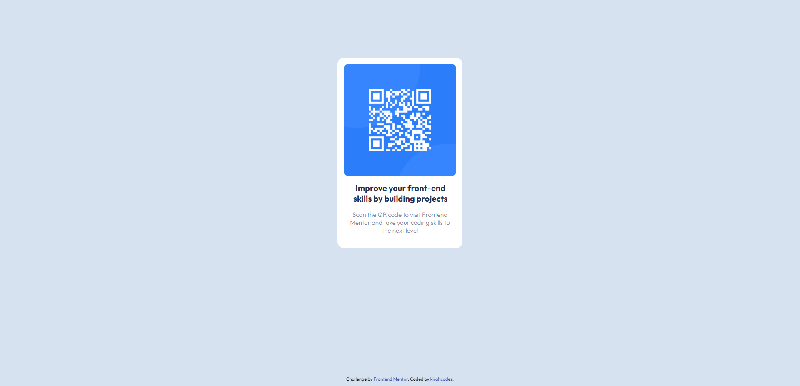

# Frontend Mentor - QR code component solution

This is a solution to the [QR code component challenge on Frontend Mentor](https://www.frontendmentor.io/challenges/qr-code-component-iux_sIO_H). Frontend Mentor challenges help you improve your coding skills by building realistic projects.

## Table of contents

-   [Overview](#overview)
    -   [Screenshot](#screenshot)
    -   [Links](#links)
-   [My process](#my-process)
    -   [Built with](#built-with)
    -   [What I learned](#what-i-learned)
    -   [Continued development](#continued-development)
    -   [Useful resources](#useful-resources)
-   [Author](#author)

**Note: Delete this note and update the table of contents based on what sections you keep.**

## Overview

### Screenshots

### Links

-   Solution URL: [GitHub Repo](https://github.com/kirahcodes/frontend-mentor-projects/tree/main/qr-code-component-main)
-   Live Site URL: [Live Site](https://your-live-site-url.com)

## My process

### Built with

-   Semantic HTML5 markup
-   CSS custom properties
-   Flexbox

### Continued development

In future projects, I plan to solidify my understanding of Flexbox and responsive design to make sure my components and web applications work flawlessly across all devices, browsers and screen sizes.

**Note: Delete this note and the content within this section and replace with your own plans for continued development.**

### Useful resources

-   [Flexbox Froggy](https://www.flexboxfroggy.com) - This helped me understand the basics of Flexbox. I would recommend it to anyone learning CSS layouts.
-   [YouTube](https://www.youtube.com) - I used YouTube tutorials to refresh my understanding of responsive design.

## Author

-   Website - [kirahcodes.com](https://www.kirahcodes.com)
-   Frontend Mentor - [@kirahcodes](https://www.frontendmentor.io/profile/kirahcodes)
-   Twitter - [@kirahcodes](https://www.twitter.com/kirahcodes)
